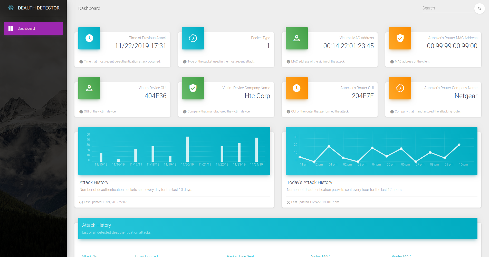

# Deauthentication Detector



## How It Works

The deauthentication detector makes use of the scapy python library to detect when a deauthentication attack is occurring. When
an attack is detected, information about the attack is captured and stored in a MongoDB database. This data is then consumed by
a Python Flask web API which serves the deauthentication attack data as JSON to a React web application which displays the
attack information as well as information about the history of previous attacks to the user in an easy to digest format.

## Prerequisites

The following are required to run the deauthentication attack detector

* Python3
* pip3
* Node.js and NPM
* Aircrack-ng
* MongoDB

## Installation Steps

Follow these steps to setup the Deauthentication Detector on your current computer

1. Clone this repository
2. Navigate to the deauth-detector directory via the command line
3. Run the initial_setup.sh bash script
```
./initial_setup.sh.sh
```
4. Once installation concludes, navigate to localhost:80 via a web browser to view the running dashboard

## ISO Image Installation Steps

Follow these steps to setup RaspberryPi - Deauthentication Detection for use with a RaspberryPi

1. Download [BalenaEtcher](https://www.balena.io/etcher/)
2. Download the RaspberryPi - [Ubuntu Server 20.04.3 arm64](https://ubuntu.com/download/raspberry-pi/thank-you?version=20.04.3&architecture=server-arm64+raspi)
3. Use BalenaEtcher to burn the Ubuntu Server .img to an sd card
4. Boot up the raspberrypi with a monitor mode enabled wifi card
5. Navigate to the deauth-detector directory
```
cd ~/deauth-detector
```
6. Pull the latest code from GitHub
```
git pull origin master
```
7. Run the initial_setup.sh bash script
```
sudo -E bash -c './initial_setup.sh'
```
8. Once installation concludes, navigate to localhost:80 via a web browser to view the running dashboard

## Resources

* [Video](https://youtu.be/SVwhGE7bZN8)
